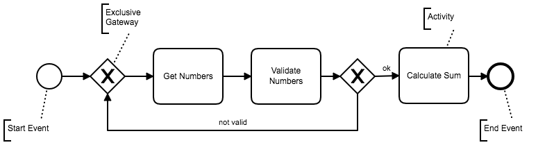
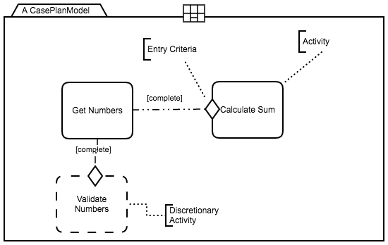

# Introduction

Processes are important concepts in modern society since they control and standardize the interactions between businesses, consumers, governments and other organizations. Tasks, roles, artifacts and relationships are central abstractions used in processes to explicitly define models for possible execution flows. However, the rise of knowledge-based industries such as financial, healthcare, software development and insurance, imposes the adoption of agile processes that do not constrain _knowledge workers’_ decisions at runtime. The interplay between agility and unconstrained knowledge workers’ behavior promotes the emergence of complex and unpredictable work-graphs [1], gathering cross-cutting processes, tasks, people, information, rules and supporting software systems, a scenario in which representing, controlling and standardizing process abstractions is challenging.

Literature from process management brings the concepts the concept of Knowledge Intensive Processes (KIPs) [2] as being collaborative, goal-oriented, knowledge dependent and non-repeatable. KIPs can range from partially structured processes occurring when the overall workflow is not explicitly defined, but the existence of policies and regulations supports the identification of structured fragments; to unstructured processes appearing when the participants define the activities to be executed. As a result, KIPs abstractions are present in modern organization-to-individual interactions and capture the complexity imposed by the processes found in knowledge-based industries.

This website intends to analyze the Knowledge Intensive Processes (KIPs) life cycle and discuss how KIPs are modeled and executed. A process life cycle can be seen as a collection of _stages_ and associated _operations_ that allow intra or inter stages transitions. A _Process Stage_ can be defined as a place sharing common definitions such as a common metamodel or the same representation language. For example a Java program may seen as having two stages, one as the Java source-code and another as the Java byte-code. The Java source-code is defined by the [Java grammar](https://docs.oracle.com/javase/specs/jls/se7/html/jls-18.html) while the Java byte-code has it's own [file format](https://docs.oracle.com/javase/specs/jvms/se7/html/jvms-4.html).
 _Transitions_  can be defined as operations allowing files moving from one stage to another (inter stage transition) or staying in the same stage with a different configuration (intra stage transition). Going back to the Java program example we can see the Java compiler as an inter stage transition as it compiles Java source-code into Java byte-code. On the other hand, a Java refactoring tool can be seen as an intra stage transition as the input and output files are both Java source-code.  
 Using stages and transitions abstractions to understand the life cycle for knowledge intensive processes allows us to isolate and dissect concepts according to an specific rationale, and provide a didactical and systematic way to explore the phenomena. Moreover, stages and transitions abstractions are commonly used in Model Driven Engineering so we can leverage on some of its frameworks and tools.    

# Motivating Examples

Knowledge Intensive Processes are everywhere but sometimes they are recognized as simple prescriptive processes. By prescriptive processes we mean processes that can be executed as is, such as in a car assembly line where parts are fed in one end of the line and cars are deterministically assembled (sometimes with the help of individuals). However modern processes typically support individuals in achieving their goals and typically deviate from the original model to accommodate specific and unplanned needs. In order to better expose the KIP phenomenon this section brings several motivating examples to expose how process are in fact complex and non-deterministic.

<table style="width:100%">
  <tr>
    <th>Process</th>
    <th>Description</th>
  </tr>
  <tr>
    <td><left><a href="./trip_plan/tp_bigpicture.html">Trip Planning</a></left></td>
    <td><justify>The Trip Planning process attempts to support a traveler to plan a trip.</justify></td>
  </tr>
  <tr>
    <td><left><a href="./fracture_clinic/fc_bigpicture.html">Fracture Clinic</a></left></td>
    <td><justify>The Fracture Clinic process ....</justify></td>
  </tr>
  <tr>
    <td><left><a href="./agile_sdp/sdp_bigpicture.html">Agile Software Process</a></left></td>
    <td><justify>The Agile Software Process ....</justify></td>
  </tr>
</table>

# KIP Life cycle

To understand knowledge intensive processes' life cycle, we first need to walkthrough process models. A process model indicates the elements that can be used as abstractions to represent real world scenarios. Process Models can be formal or informal. A _formal process model_ precisely describes a flow of work and is typically executed using a Workflow Management System (WMS) or a Process Aware Information System (PAIS). On the other hand an _informal process model_ is usually interpreted by humans and used as a discussion or documentation tool.

A process model can be represented with several languages such as [YAWL](), [BPMN](), [UML Activity Diagrams]() or [Petri Nets](). Although most languages share some similarities and are capable of representing process abstractions such as activities, sequencing and decisions, we will illustrate most of the process models used in this text with BPMN (Business Process Modeling Notation) as BPMN is recognized as the de facto process modeling language. We will also use CMMN (Case Management Modeling Notation), as CMMN allows representing flexible workflows that can be called from BPMN process or executed standalone. Both notations, BPMN and CMMN, are supported by several tool vendors (SAP, IBM, BizAgi, Signavio, Camunda, etc.) and can describe formal or informal processes. It is important to mention KIPs may require other abstractions than those found in BPMN and CMMN as exposed in [KIPO](https://link.springer.com/article/10.1007/s10270-014-0397-1), but we will annotate the model when required.  

## BPMN
A BPMN model allows representing activities that are organized in a workflow. Activities represent actions that can be executed by humans, external systems or other processes. The workflow indicates the sequence in which activities should be executed. The workflow may also contain gateways to indicate conditional or parallel flows and loops. Fig. 1 represents a simple _Addition Process_  starting with an activity (_Get Numbers_) to obtain the input numbers. Then the process validates those numbers (_Validate Numbers_) and moves on to calculate the sum (_Calculate Sum_) if the numbers are valid; if not valid, the process flow goes back to get new input numbers.

 
 Fig1. Simple Addition Process

BPMN has several modeling elements to represent complex processes (events, pools, lanes, subprocesses, etc) that we will explain when needed. More information on BPMN models can be found [here](http://www.bpmnquickguide.com/quickguide/index.html?bpmn_examples.htm) and [the official documentation here](https://www.omg.org/spec/BPMN/2.0/).

## CMMN

A CMMN model allows representing flexible processes often called cases. Besides representing activities likewise in BPMN, a case can contain discretionary elements that may or may not be executed. For example, a discretionary activity indicates such action is not mandatory to complete the process and may be skipped depending on the process execution context.
Another important difference between BPMN and CMMN is how they represent sequences. In BPMN sequences are represented as directed edges connecting two model elements whereas in CMMN sequences can be modeled using connections and sentries (entry or exit criteria). For example, Fig2 illustrates the same _Addition Process_ using CMMN where the _Get Numbers_ and _Calculate Sum_ activities are connected using a dashed-dot line and a sentry (shallow diamond). The dashed-dot line is decorated with the term _complete_ and is combined with the sentry to indicate the _Calculate Sum_ activity can only start when the _Get Numbers_ activity is completed, thus representing a sequence.

Fig2 also represents the activity _Validate Numbers_ decorated with a dashed line to indicate such activity is discretionary. Different from the BPMN version of the _Addition Process_ that uses a gateway to represent an optional flow, the CMMN model leaves the decision to apply or not apply validation to the case worker. As a result, when the CMMN version of the _Addition Process_ process starts the _Get Numbers_  activity will be available to execute but _Validate Numbers_ and _Calculate Sum_ will become available only when _Get Numbers_ is completed. Given _Validate Numbers_ is discretionary, the process may execute _Calculate Sum_ without waiting for the validation action.

 
 Fig2. Simple Addition Process in CMMN

CMMN has also several other modeling elements (stages, milestones, case files, etc.) that we will explain when needed. We found a nice explanation for CMMN [here](http://knut.hinkelmann.ch/lectures/bpm2015-16/04_CMMN.pdf) and the [official documentation here](https://www.omg.org/spec/CMMN/About-CMMN/).

## Life cycle

A [life cycle](https://www.merriam-webster.com/dictionary/life%20cycle) is defined as "_a series of stages through which something (such as an individual, culture, or manufactured product) passes during its lifetime._" Processes have life cycles as they are created, executed and in some way finalized. We define the pre-birth stage of a process as the _Conceptual Stage_ where processes are experimented without paying attention to the representation language. Then a process can be _materialized_ using a formal representation language as a process model and move on to the _Process Model Stage_. Representing process models with a formal notation is important as it facilitates using several analytical tools such as model-checkers, quality assessment, workflow management systems, compliance monitoring, process mining, etc. Moreover, using a standard notation such as BPMN and CMMN promotes information sharing among the process community.

The _Working Plan_ is the next stage, when the Process Model can be _instantiated_ into several different instances. These instances can also be seen as each time the process is executed, totally or partially. At this stage, workers can work on specific chunks of tasks that have information such as their own due date, for example, and are part of a bigger project plan. 
_Logs_ are generated for each step of the instance execution, called _enactments_. This is the next stage of the life cycle. Whether each chunk of the instance is created or edited, modifications will be logged. These logs enable future analysis on how much compliant the execution was in regard to the Process Model. 

More details on each of the stages and transitions are below. 

<!-- The process management literature uses extensively the PDCA (plan-do-control-act) cycle to demonstrate 
<!--runtime vs design time vs conception time vs analysis runtime
PDCA
In order to dissect the concepts related to knowledge intensive process one must understand the  -->

## KIP Stages

***

### Conceptual

Tacit knowledge is a big asset when performing knowledge-intensive processes. Although not explicitly materialized, tacit knowledge, which can also be seen as the experience of the worker, comprises one of the elements in the Conceptual View. Bodies of knowledge are also part of this Conceptual View. Examples of bodies of knowledge are knowledge bases, wikis, product reference manuals and documentation, and even maturity models or ISO documentations. Conceptual information can be either expressed in Natural Language or Structured Natural Language.

***

### Process Model

Process Model stage is when processes can be modeled and expressed into a set of activities and their dependencies. Processes are extracted (reified) from the available concepts (Conceptual View), and created according to the methodology of the process defined. Processes have information such as the activity name, role, artifact, flow, decision, event, and rule.

*Activity* is the identification a piece of work that needs to be performed when executing the process.
*Role* is the identification of which department, person or external parties are responsible for the execution of the activities.
*Artifact* is the data that can be used as input or is the output of each activity. 
*Flow* is the direction of the activity. It indicates whatever occurs before and after each activity.
*Decision* is when there is the need to act upon occurrences that are optional. It can either result in the execution of an activity, or multiple activities, as well as it can lead to another decision or artifact.
*Events* are instant occurrences in the process. They usually have a cause and an impact.
*Rules* can be defined as the constraints that processes should consider when executed.

Processes’ activities can be tailored or merged. Tailoring means It is possible to customize a process for a specific instance execution on the next stage - the Work Plan - and merging means it is possible to execute two or more process activities at once. Merging activities also means changes will occur from this stage of the life cycle on. 

***

### Working Plan

The Working Plan stage represents the moment process activities, methodology, technical tacit or explicit knowledge are represented by chunks of work meant to be done. One process generates one or more work plans. One working plan has information such as task, person, milestone, flow, decision, event and iteration. 

*Task* is a chunk of executable work.
*Person* is whoever is responsible for working on that task. This person should also be responsible for communicating occurrences while working on each task. 
*Milestone* is the goal that a set of tasks is supposed to reach. 
*Flow* is the indication of which task is executed before and which task is executed after a task.
*Decision* …
*Event* … 
*Iteration* is each set of tasks that can produce a minimum deliverable. The tasks to be executed in each iteration are selected at total discretion of the project manager and team, according to what’s been agreed with the client/stakeholders. 

Communications, task length definition in this stage depend on people, which makes the process vary according to decisions made when either planning or executing a task. What information is relevant to a person can also vary. These characteristics of knowledge-intensive processes are evident at this stage. 

***

### Log

Now, Log Stage will be described.
***

## KIP Transitions

bla... KIP Transition Text

***

### Reification

bla...

***

### Tailoring

bla...

***

### Instantiation

bla...

***

### Execution/Enactment

bla...

***

### Improvement

bla...

***
