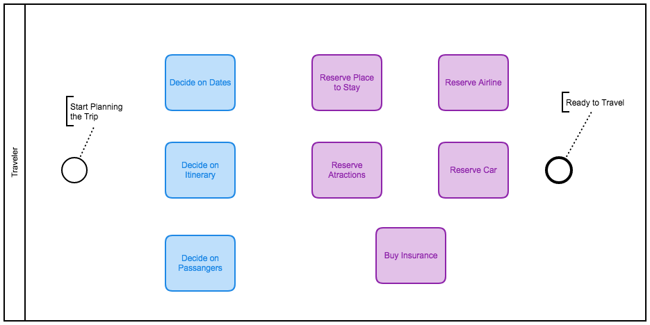
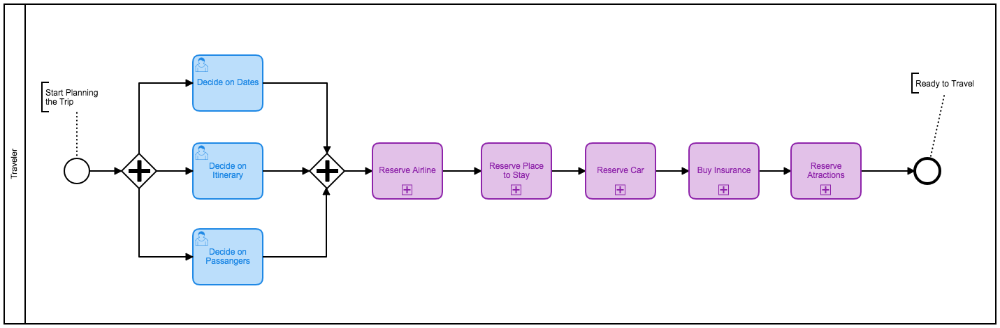
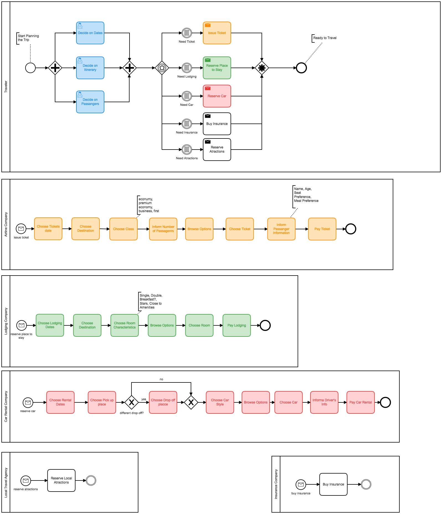
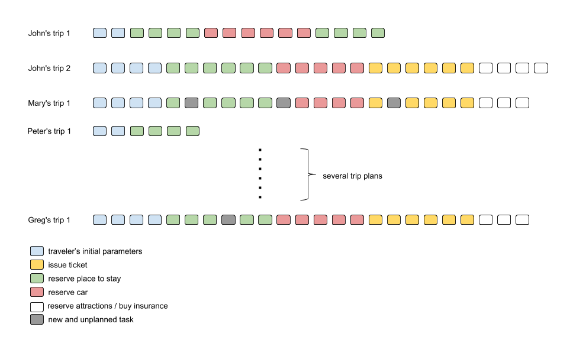

# Trip Planning Procedure

## The Big Picture

Planning a trip is a recurring endeavor typically requiring the execution of activities such as:

 - defining the itinerary;
 - defining the start and end dates;
 - deciding on the number of travelers;
 - booking the airline;
 - booking a place to stay;
 - reserving a car;
 - reserving attractions;
 - buying insurance;

To  facilitate the Trip Planning Procedure the traveler might just set the initial parameters (itinerary, dates, travelers), negotiate everything with a travel agency or buy a pre-packaged trip (What is the fun in that!!!).  A more intrepid traveler might enjoy the do-it-yourself approach and spend hours - possibly days - navigating on several websites to better understand the options available, and create a bespoke traveling experience. Maybe the dates are flexible and the travelers can fly on cheaper flights! Maybe the itinerary is flexible and the travelers might be able to explore local hidden gems! Maybe, after you bragging about your travel plans on a family Sunday lunch, gramma decides to jump in!

In order to organize and control the Trip Planning Procedure the intrepid traveler may create a simple TODO list to expose the activities and associated information required to complete the plan.  The list might be executed as per the traveler's discretion but some rules must be followed such as setting the initial parameters (itinerary, dates, travelers) upfront. Fig.1 brings a [BPMN](http://www.bpmn.org/) (Business Processes Modeling and Notation) process model to represent the TODO list in a "sophisticated" way.

 
 Fig1. Trip Planning Process

Besides representing the activities, Fig1. process model attempts to connect them in a streamlined flow, from the process starting point (_Start Planning Trip_) to the process endpoint (_Travelers Ready to Travel_). The rationale of streamlining the activities to plan the trip is to make the traveler more efficient and effective while using a systematic flow of activities. However, defining such flow seems complex: What should be done first? Reserve the Place? or Reserve the Airline? How may times can the same activity be executed to accommodate new demands? How to incorporate the activities related to the supporting IT infrastructure (e.g. airline websites, credit card authentication, etc.)?

A simple and straightforward answer to these questions is: It all depends on the traveler's context. The traveler's context maybe simple if the traveler is traveling alone, with a single destination, thus simplifying decisions. The context maybe complex, involving several travelers with different needs (remember gramma!) and multiple destinations, which brings issues related to [collaborative decisions](https://pdfs.semanticscholar.org/e513/012a806d70c66b80dfd3dd5d14a2b4efafaa.pdf). As a result, creating a one-model-fits-all seems unproductive, if not impossible. Still, one can argue the model maybe created by a trip planning expert but it is important to understand the intrepid traveler is a knowledge worker with a sophisticated decision making attitude who is capable of tweaking the trip parameters to achieve a better deal and forcing a pre-established flow of activities may hamper creating the plan.

A better way to represent the Trip Planning Procedure is using the [Knowledge Intensive Process](https://doi.org/10.1007/s13740-014-0038-4) paradigm where the process model may indicate an accepted flow of activities, but the traveler is free to combine the activities to fit his/her needs. For example, Fig. 2 illustrates a simple flow where the traveler decides the initial parameters, then he/she deals with the airline, hotels, car, insurance and attractions sequentially. The process model is then an indication to help the intrepid traveler understanding what needs to be executed to plan the trip.

 
 Fig2. Trip Planning Process Simple Flow

A further look at Fig2. exposes some activities (the purple ones) have a '+' sign at the bottom indicating the activity is in fact a [process itself](https://camunda.com/bpmn/reference/#activities-subprocess), sometimes with several nested flows. For example, to _Reserve the Airline_, the traveler needs to choose the class (first, business, coach), the seat (window, aisle), the food (vegetarian?) and also pay using a credit card (or miles). It is easy to imagine the whole Trip Planning Procedure may require executing dozens of different activities, some human based, some hidden by the IT infrastructure. For example, Fig3. exposes a more complex process involving several companies (illustrated as [pools](https://camunda.com/bpmn/reference/#participants-pool)) and [messages](https://camunda.com/bpmn/reference/#events-message) sent from the travelers side. This complex process model may be straightforward to follow based on the coloring scheme or given the  messages used to trigger the corresponding process start-events have the same names. However, the  complexity can be seen as the model brings a multitude of different modeling elements (lanes, tasks, messages, gateways and start-events) and also starts dealing with complex collaboration patterns. It is important to mention this process is still far away from being realistic as there are few decisions ([gateways](https://camunda.com/bpmn/reference/#gateways-data-based-exclusive-gateways)), no data objects, no error-handling and no IT related tasks.   

 
 Fig3. Trip Planning Process Complex Flow

At the end of the day, our intrepid traveler may end up executing dozens of tasks depending on his/hers particular context. Moreover, planning a trip is a recurring procedure and this process model may be enacted by different travelers, sometimes sharing the same context and following similar flows. The resulting log illustrated by Fig4. exposes traces of tasks executed by each traveler. For example, _Traveler John_ enacted the process twice (planning two trips) and _Traveler Greg_ enacted the process once. The differences between each trace indicates it may be hard to impose a prescribed sequence of tasks, even considering all travelers managed to reach the process endpoint. It is also important to point out traces do not only differ based on task sequences but also on unplanned tasks. An unplanned tasks (gray nodes) occur when a traveler executes a task that was not part of the original process model, indicating the process may be incomplete and does not fit well to the travelers context.

In this scenario, some complex questions arise: How to keep track of my progress?  How to pass on a Trip Planning Procedure experience? How to learn from planning several trips? How to avoid recurring mistakes/problems? How to combine several trip planning experiences? and recommend the most successful ones? What if someone needs to execute an unplanned (not defined in the TODO List) activity? How to access the information one need at the proper time?

 
 Fig4. Trip Planning Process log

[home](../index.html)
